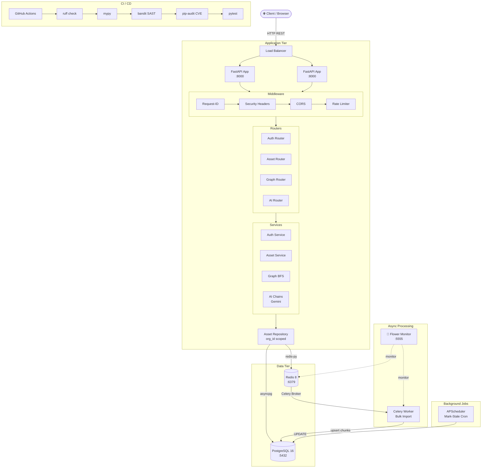

# System Design
## DarkAtlas — Asset Management System

**Version:** 1.0  
**Date:** June 2026

---

## 1. Overview

The DarkAtlas Asset Management System is a multi-tenant SaaS platform for cybersecurity teams to track, manage, and query their attack surface assets. It is designed for high availability, horizontal scalability, and strict tenant isolation.

---

## 2. System Architecture Diagram



---

## 3. Infrastructure Components

### 3.1 FastAPI Application

| Property | Value |
|---|---|
| Framework | FastAPI 0.138 + Uvicorn 0.49 |
| Workers | Multiple (stateless, horizontally scalable) |
| Async | Full `async/await` throughout |
| Port | 8000 |

**Middleware stack (applied in order):**
1. `Request-ID` — injects UUID, binds to structlog context
2. `SecurityHeadersMiddleware` — OWASP headers (HSTS, CSP, X-Frame-Options, etc.)
3. `CORSMiddleware` — configurable origins
4. `SlowAPIMiddleware` — per-endpoint rate limiting

### 3.2 PostgreSQL 16

| Property | Value |
|---|---|
| Port | 5432 (Docker) / 5433 (local dev) |
| Driver | asyncpg (async) |
| ORM | SQLAlchemy 2.0 async |
| Migrations | Alembic (async-aware) |
| Max connections | 500 (configured via `max_connections`) |
| Pool | NullPool in tests, default pool in production |

**Key schema design choices:**
- GIN index on `assets.tags[]` — enables fast `@>` containment queries
- GIN index on `assets.metadata JSONB` — key-value filter queries
- Composite B-tree on `(org_id, type)`, `(org_id, status)`, `(org_id, last_seen)` — filtered list performance
- `UNIQUE (org_id, type, value)` — deduplication constraint
- `UNIQUE (org_id, source_id, target_id, rel_type)` on relationships — prevents duplicates

### 3.3 Redis 8

| Property | Value |
|---|---|
| Port | 6379 |
| Client | redis-py (async) |
| Usage | Multi-purpose (see table below) |

| DB | Purpose |
|---|---|
| 0 | General cache (settings, sessions) |
| 1 | Celery task broker |
| 2 | Celery result backend |
| 13 | Celery result backend (local dev) |
| 14 | Celery broker (local dev) |
| 15 | General (test environment) |

**Data stored in Redis:**
- Refresh tokens (as `SHA-256` hashes, 7d TTL)
- Import job progress (`HSET job:{id} imported N error_count M`)
- Rate limit counters

### 3.4 Celery Worker

| Property | Value |
|---|---|
| Broker | Redis DB 1 |
| Concurrency | 20 workers |
| Prefetch | 1 (fair dispatch) |
| `task_acks_late` | True (re-queued on worker crash) |

**Bulk import chunking:**
```
1M records ÷ 5,000/chunk = 200 chunks
200 chunks × asyncpg executemany = ~7 min local hardware
```

### 3.5 Flower (Task Monitor)

- Celery task monitoring dashboard
- Port: 5555
- Reads from same Redis broker as Celery

### 3.6 APScheduler

- In-process scheduler (no separate service)
- Runs `mark_stale_assets` cron every N hours
- `max_instances=1` prevents overlapping runs on slow DB

---

## 4. Data Flow Diagrams

### 4.1 Single Asset Upsert

```
Client
  │  POST /api/v1/assets
  │  { type, value, source, tags, metadata }
  ▼
Auth Middleware
  │  decode RS256 JWT → (user_id, org_id, role)
  ▼
Asset Router
  │  RBAC check: analyst+
  │  Input sanitization (null bytes, length, allowlists)
  ▼
Asset Service
  │  Build upsert payload
  ▼
Asset Repository
  │  INSERT ... ON CONFLICT (org_id, type, value) DO UPDATE
  │    SET last_seen = NOW()
  │        status   = CASE WHEN ...
  │        tags     = ARRAY(SELECT DISTINCT unnest(existing || incoming))
  │        metadata = existing || incoming
  │  RETURNING *
  ▼
Response
  { id, org_id, type, value, status, first_seen, last_seen, tags, metadata }
```

### 4.2 Bulk Import Flow

```
Client
  │  POST /api/v1/assets/bulk-import { records: [...] }
  ▼
Asset Service
  │  Validate schema (Pydantic)
  │  Create ImportJob in DB (status=queued)
  │  celery.delay(job_id, org_id, records)
  │  Return { job_id, status: "queued", total: N }
  ▼
Celery Worker (async)
  │  UpdateJob(status=running)
  │  FOR each 5,000-record chunk:
  │    asyncpg executemany upsert
  │    Redis HSET job:{id} imported=N
  │  UpdateJob(status=done/failed)
  ▼
Client polls: GET /api/v1/jobs/{job_id}
  │  Read from Redis HSET (live)
  │  Fallback to DB ImportJob (after Redis TTL)
  │  Return { status, total, imported, error_count, progress_pct }
```

### 4.3 AI Query Flow

```
Client
  │  POST /ai/query { "query": "stale certs on prod" }
  ▼
AI Router → chains.py
  │
  ├─► Gemini 2.0 Flash (temperature=0)
  │     Prompt: "Given the available asset types and filters,
  │              generate a JSON filter for: {user_query}"
  │     Output: { "type": "certificate", "status": "stale", ... }
  │
  ├─► Pydantic validates filter schema
  │     IF invalid → HTTP 422 (never a 500)
  │
  └─► Asset Repository.list_assets(validated_filter)
        → Real DB query, org-scoped
        → Return actual assets to client

LLM CANNOT invent assets — only generates filters.
All records come from the real database.
```

### 4.4 Authentication Flow

```
POST /auth/login { email, password }
  │
  ├─► Lookup user by email (constant-time, even if not found)
  ├─► bcrypt.verify(password, hash)  ← rounds=12
  ├─► Generate access token (RS256, 15m)
  ├─► Generate 32-byte random refresh token
  ├─► Redis SET sha256(refresh_token) → user_id  TTL=7d
  └─► Return { access_token, refresh_token }

POST /auth/refresh { refresh_token }
  │
  ├─► Compute SHA-256(token)
  ├─► Redis GET → user_id  (fails if expired/revoked)
  ├─► Redis DEL sha256(old_token)      ← rotation: old invalid
  ├─► Generate new pair
  └─► Return new { access_token, refresh_token }
```

---

## 5. Multi-Tenancy Design

### Row-Level Isolation (default)

All queries in `AssetRepository` are scoped at construction time:

```python
class AssetRepository:
    def __init__(self, db: AsyncSession, org_id: UUID):
        self.org_id = org_id  # set once, used in every query

    async def list_assets(self, ...):
        q = select(Asset).where(Asset.org_id == self.org_id)
        # org_id filter is structurally enforced, not optional
```

Cross-tenant leaks are impossible at the SQL level, independent of the service layer.

### Database-Level Isolation

When `TENANT_ISOLATION=database`:
- Each org gets its own PostgreSQL database
- `TenantConnectionManager` maintains an LRU cache of up to 50 engines
- Connection string: `postgresql+asyncpg://.../{org_slug}_db`

---

## 6. Scalability Considerations

| Concern | Solution |
|---|---|
| API horizontal scale | Stateless FastAPI workers behind load balancer |
| DB connection limits | asyncpg connection pooling + `max_connections=500` |
| Bulk import | Off-loaded to Celery — API returns immediately |
| Large result sets | Pagination capped at 100 records/request |
| Tag/metadata filtering | GIN indexes on PostgreSQL arrays and JSONB |
| Graph traversal | BFS depth capped at 5 + iterative (no stack overflow) |
| Rate limiting | Per-endpoint slowapi with Redis state |

---

## 7. Deployment (Docker Compose)

```yaml
services:
  postgres:   PostgreSQL 16 · port 5432 · volume: postgres_data
  redis:      Redis 8       · port 6379 · volume: redis_data
  app:        FastAPI       · port 8000 · depends_on: postgres + redis
  celery:     Celery Worker · depends_on: postgres + redis
  flower:     Celery UI     · port 5555 · depends_on: redis
```

All services include health checks. App only starts after postgres and redis are healthy.

---

## 8. Observability

| Signal | Implementation |
|---|---|
| Structured logs | structlog JSON (request_id, org_id, duration_ms) |
| Request tracing | `X-Request-ID` header on every response |
| Task monitoring | Flower dashboard at :5555 |
| Health check | `GET /health` — verifies DB + Redis connectivity |
| Error handling | Global exception handler — stack traces never reach client |
