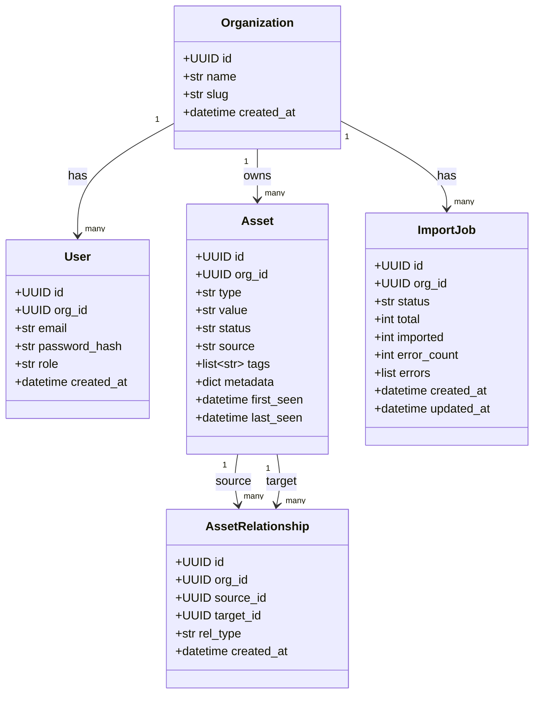
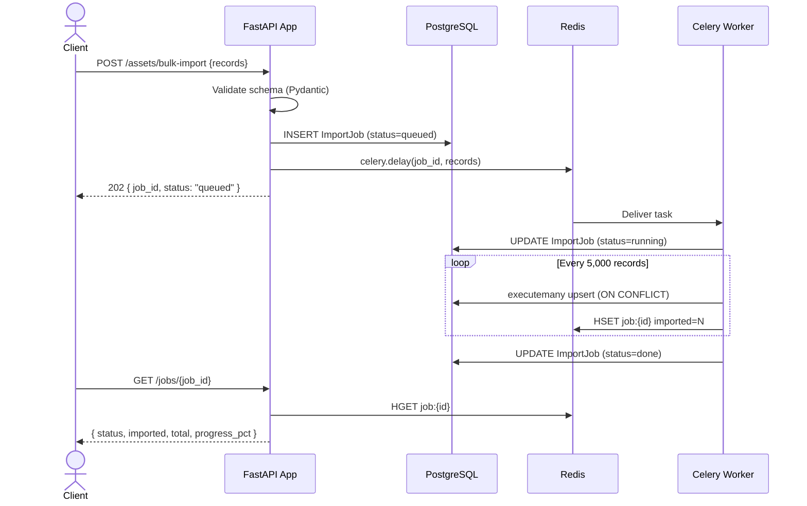
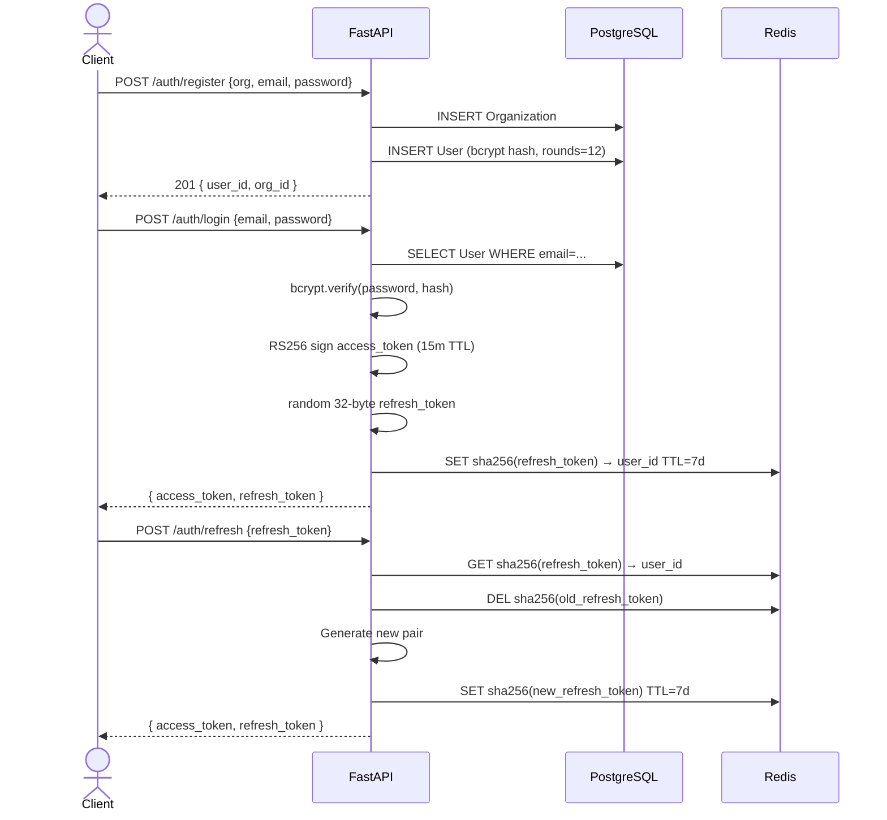
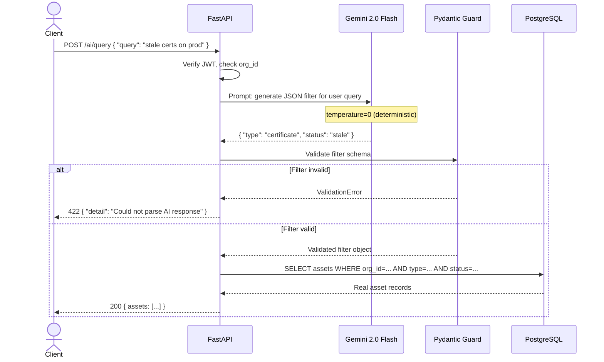
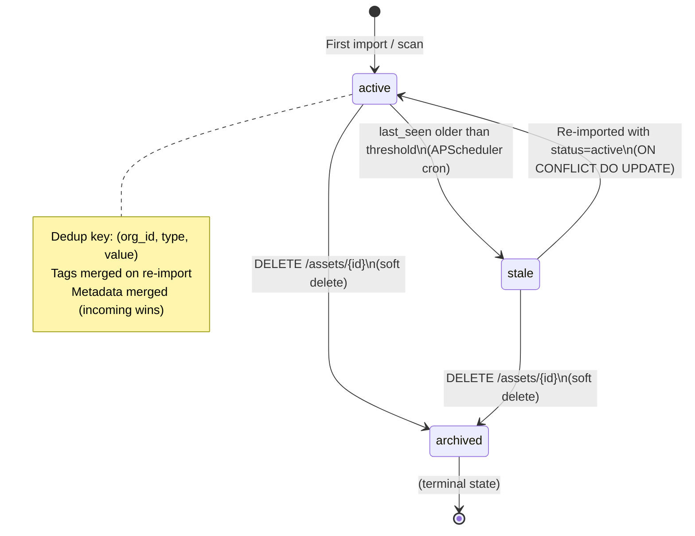
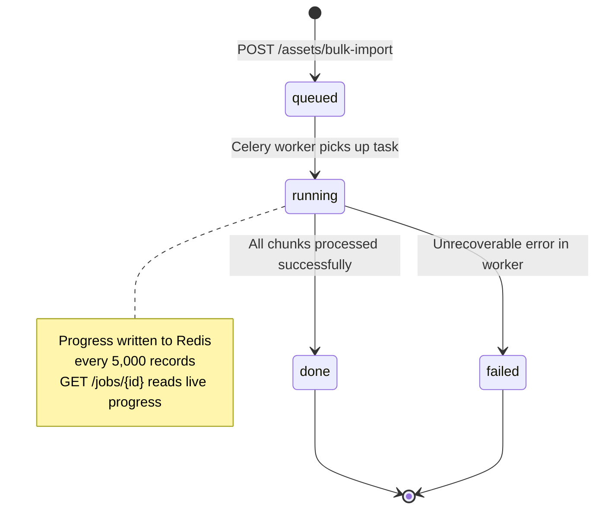
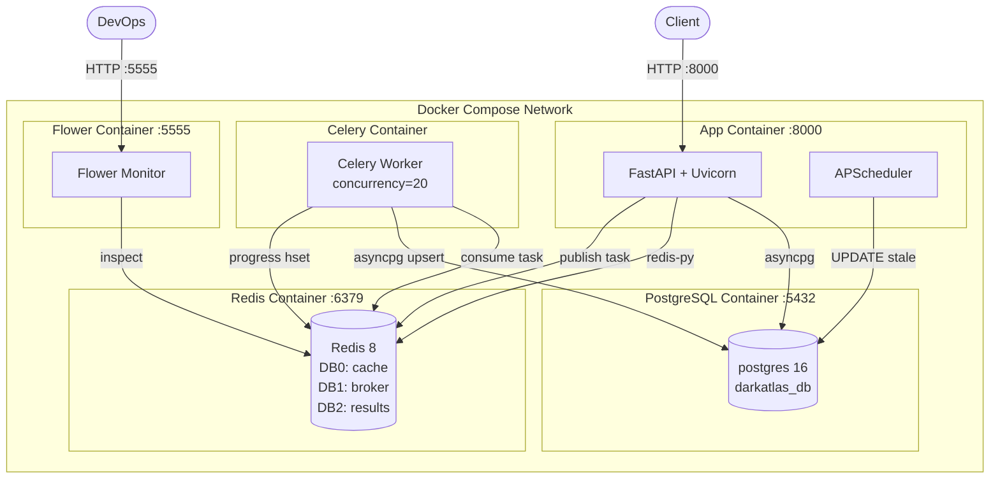
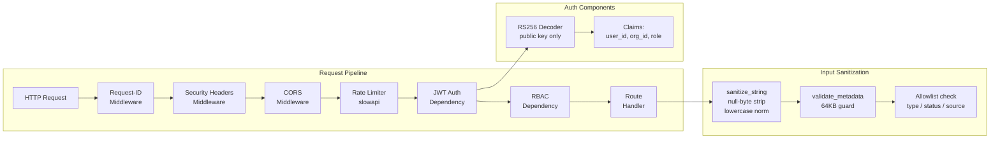

# UML Diagrams
## DarkAtlas — Asset Management System

---

## 1. Class Diagram — Core Domain Models

---

## 2. Sequence Diagram — Bulk Import

---

## 3. Sequence Diagram — Authentication

---

## 4. Sequence Diagram — AI Natural Language Query

---

## 5. State Diagram — Asset Lifecycle

---

## 6. State Diagram — Import Job

---

## 7. Deployment Diagram

---

## 8. Component Diagram — Security

